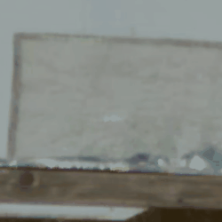

# Gaz Flash Ignition Information

## Reproduction in Ballistic Gel 

There's a **TON** of videos on youtube where you see bullets hitting ballistic gel. In fact, when writing this up, I did *one search* and I found the video below in my first results and was able to find the yellow flame in the video. 
Im sure if you look at other video on bullets in ballistic gel, you'll see similar results in other videos.

The video named **BARRETT .50 CAL vs. BALLISTICS GEL! 50 BMG ballistics testing in SUPER SlowMo (4K)** ( [link](https://www.youtube.com/watch?v=5J9hCDr21mo) ) on the [Lena Miculek - Trigger Tribe](https://m.youtube.com/@LenasTriggerTribe) channel shows what I mean.

At [about 2m05s](https://www.youtube.com/watch?v=5J9hCDr21mo&t=124s), you see the ballistic gel recompressing after initial expansion, and then we get a gaz flash-ignition.

I edited a small portion of the video here:

### Other Videos

[STRONGEST .50 Cal Rounds vs Tungsten Cube](https://www.youtube.com/watch?v=QmLjMz6UNBE)

